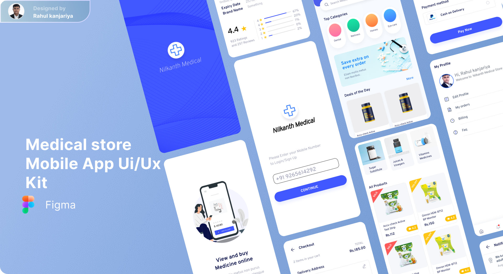
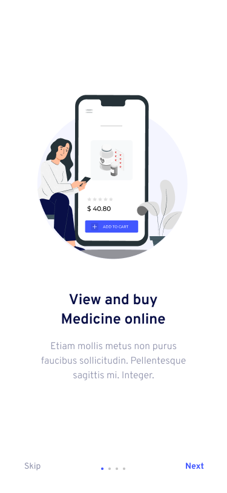
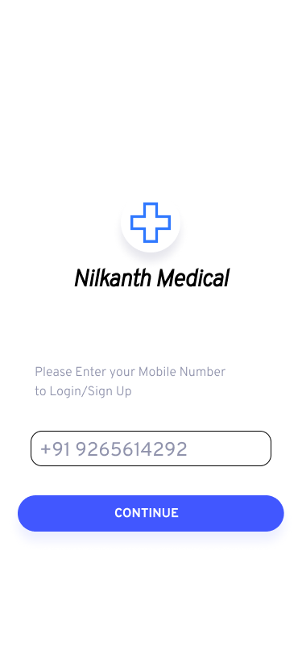
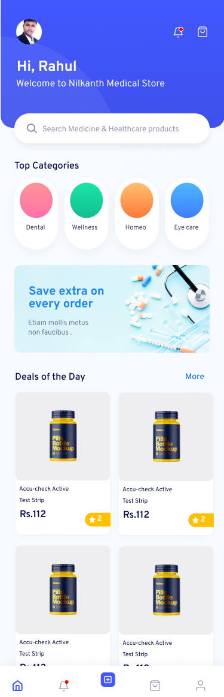
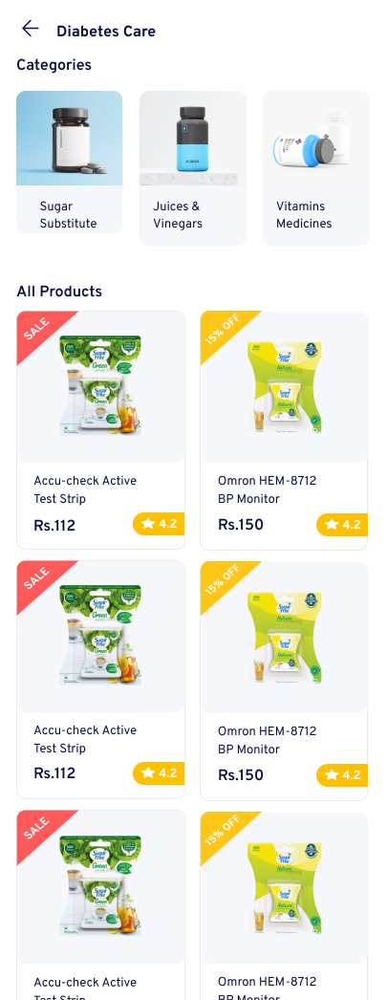
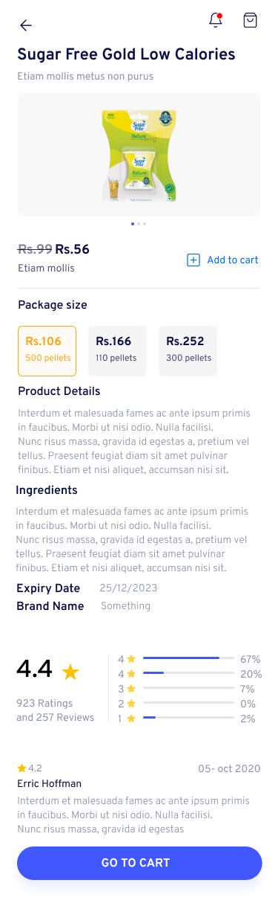
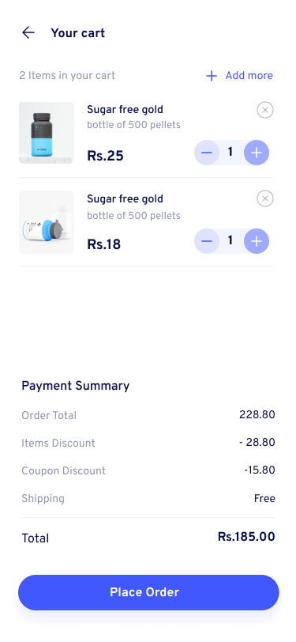
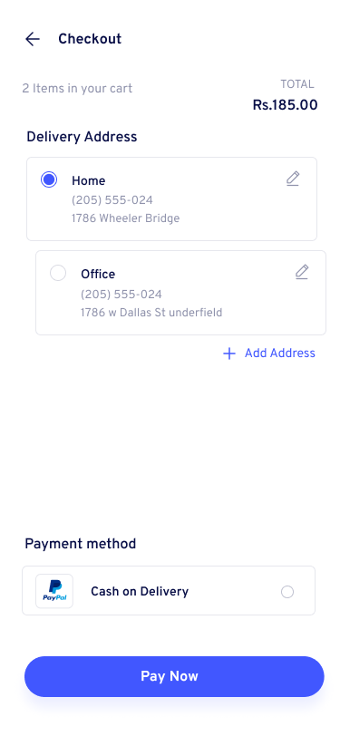
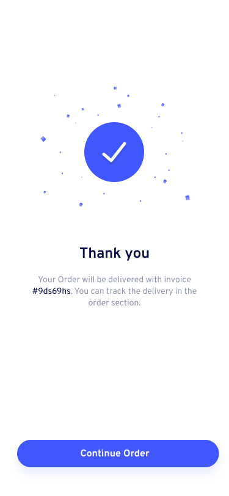
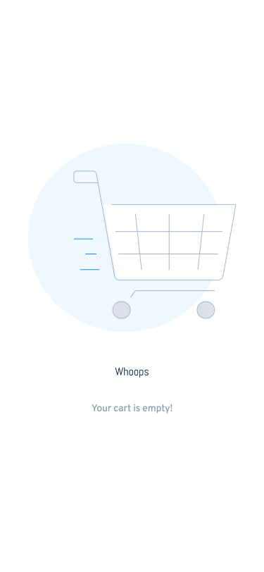

# Medical Store Mobile App

## About
The Medical Store Mobile App is a convenient solution designed to view and buy medicine online for a medical store or pharmacy. App concept created and inspired by [Medical Store Mobile App.](https://www.figma.com/community/file/1297807719871620552) design found on figma.
The mobile or web app was created to simulate all the system behind the UI kit in the link. There's no code on backend or other web service. The app is all contained in this repository. The models classes was created to better representate an official development, the repositories classes simulate a web request.

## Supported Devices and OS
### The app runs on the following device and platforms
* Android - Native
* iOS and macOS - Native App

## Supported Modes
### The app runs on the following modes
* Portrait

## Features

- **Medicine Catalog:** Browse and search through an extensive catalog of medicines with detailed information.

- **Order Processing:** Allow customers to place orders through the app, and efficiently pay for those orders and give their delivery location.

- **User Authentication:** Securely authenticate both customers through phone number verification to ensure data privacy.

- **Notifications:** Receive important alerts and notifications about orders, popular medicines, offers and more.

## Getting Started

### Prerequisites

- Ensure you have [Flutter](https://flutter.dev/docs/get-started/install) installed on your machine.
- Have a compatible IDE like [Visual Studio Code](https://code.visualstudio.com/) or [Android Studio](https://developer.android.com/studio) for development.

### Installation

1. Clone the repository:

    ```bash
    git clone https://github.com/jeremy02/Medical_Store_Mobile_App.git
    ```

2. Navigate to the project directory:

    ```bash
    cd Medical_Store_Mobile_App
    ```

3. Install dependencies:

    ```bash
    flutter pub get
    ```

4. Run the app:

    ```bash
    flutter run
    ```

## Full Mockup UI Previews
Medical Store Mobile App Preview           |
:-------------------------:

<div style="width: 60%; height: 60%">



</div>

Medical Store Mobile App Screens           |
:-------------------------:

<p align="center">
  
  
  
  
</p>

<br/>
<p align="center">
  
  
  
  
</p>

<br/>
<p align="center">
  
  
  
  
</p>

## Contributing

This project follows the [all-contributors](https://github.com/all-contributors/all-contributors) specification. Contributions of any kind welcome!

## Notes
In Progress